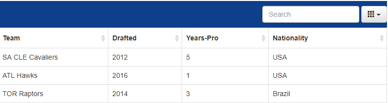
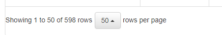
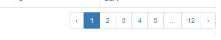

NBA players Stats API project
===

This is a simple API project, which core is to use three different publicly available JSON files:

*Players info:
```
http://data.nba.net/10s/prod/v1/2016/players.json
```
*Players stats:
```
https://stats.nba.com/stats/commonplayerinfo?PlayerID=2544
```
*Players pictures:
```
https://ak-static.cms.nba.com/wp-content/uploads/headshots/nba/1610612739/2017/260x190/2544.png
```
Used technologies:

*Javascript;  
*Jquery;  
*Bootstrap;  
*Handlebars.js;  
*AJAX.
---
##Tutoeial and Advantages:

Project is included with search input and column display selection button:


There is also a button which allows you to change the amount of rows in your table: 


Of course if you can change the amount of rows you would need paginating: 


When you select a player on the table, from top pops up aplayer picture with his current stats in a league.

---
##Future goals:

*Include more features;  
*Include another leagues or sports stats;  
*Include more powerfull frameworks: AngularJS/React.js;  
*Make it more responsive.  
*And so on....
